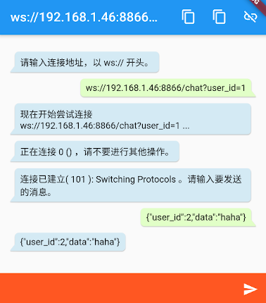

# ya_websocket

一个使用 iOS 和 Android 上原生库进行 WebSocket 通信的 Flutter 插件。

Flutter plugin for WebSocket communication using native libraries on iOS and Android.

由于使用 Flutter 的 WebSocket 库尝试连接某台 IoT 设备通信时，总是无法连接，所以单独做了一个 WebSocket 库，它基于各系统中已经成熟的库进行通信。

## 感谢这些好用的库 | Acknowledgements

|  平 台  | Flutter 插件语言 | 原生端使用的库 | 库版本 | 库使用的语言 |
| ------- | ---------------- | -------------- | ------ | ------------ |
| iOS     |      Kotlin      |[Java-WebSocket](https://github.com/TooTallNate/Java-WebSocket)| 1.5.2  |    Java      |
| Android |      Swift       |   [Starscream](https://github.com/daltoniam/Starscream)   | 4.0.4  |    Swift     |

## 系统版本要求 | Supported platforms

|  平 台  | 可运行最低版本 | 推荐最低版本 |
| ------- | -------------- | ------------ |
| Flutter |       2        |     2.2.3    |
| iOS     |       10       |      14      |
| Android |       4.1      |      11      |

在使用本插件前，请先将 APP 的适用版本设置为「可运行最低版本」之上。

## 引入 | Installing

- 如果您准备使用 release 发布版本：
  - 在项目目录中，运行 `flutter pub add ya_websocket` 。
  - 运行后，您项目中 `pubspec.yaml` 中的 `dependencies:` 节会自动添加一行代码（并自动运行 `dart pub get`） ：
```
  ya_websocket: ^(使用的版本号,你也可以修改它)
```

- 如果您准备使用 main 主线版本，请添加：

1. 编辑您项目中的文件 `pubspec.yaml`，在 `dependencies:` 节添加以下代码：

```
  ya_websocket:
    git:
      url: git://github.com/kagurazakayashi/yaWebSocket.git
      ref: main
```
2. 保存后，在项目目录中运行 `flutter pub get` .

## 使用 | Usage

1. 导入包: `import 'package:ya_websocket/main.dart';`
2. 在需要的类中实现接口 `class ... implements YaWebsocketDelegate`，实现以下接口：
  - 已连接时
    - `yaWebsocketDelegateOnOpen(String httpStatus, String httpStatusMessage, String? tag);`
    - 参数:
      - `httpStatus`: HTTP 状态码
      - `httpStatusMessage`: 状态描述文本
      - `tag`: 自定义标记
  - 开始尝试连接时
    - `yaWebsocketDelegateOnConnecting(String? tag);`
    - 参数:
      - `tag`: 自定义标记
  - 收到信息时
    - `yaWebsocketDelegateOnMessage(String message, String? tag);`
    - 参数:
      - `message`: 信息内容
      - `tag`: 自定义标记
  - 连接关闭时 (Android 和 iOS 返回信息可能有区别)
    - `yaWebsocketDelegateOnClose(String code, String reason, String remote, String? tag);`
    - 参数:
      - `code`: 状态代码
      - `reason`: 描述文本
      - `remote`: 是否由远程关闭
      - `tag`: 自定义标记
  - 连接发生错误时 (Android 和 iOS 返回信息可能有区别)
    - `yaWebsocketDelegateOnError(String localizedMessage, String? message, String? tag);`
    - 参数:
      - `localizedMessage`: 本地化描述文本
      - `message`: 描述文本
      - `tag`: 自定义标记
3. 创建对象: `YaWebsocket websocket = YaWebsocket();`
4. 指定接口实现类: `_websocket.delegate = this;`
5. 开始连接: `websocket.connect(uri, tag: tag);`
  - 参数:
    - `uri`: Websocket 的连接地址，以 `ws://` 开头。
    - `tag`: 可选标签，可以输入任意字符串，库调用接口返回时，会带上它。
  - 返回值（字符串字典）:
    - `status`:
      - `0`: 现在开始连接，请等待接口收到 `yaWebsocketDelegateOnOpen` 或 `yaWebsocketDelegateOnClose` 调用后再进行下一步。
      - `-1`: 未能开始连接
    - `info`: （可选）如果未能开始连接，可能提供此错误信息描述
6. 检查是否连接 `websocket.isOpen();`
  - 返回值（字符串字典）:
    - `status`:
      - `1`: 已连接
      - `0`: 未连接
      - `-1`: 未能查询
    - `info`: （可选）如果未能查询，可能提供此错误信息描述
7. 发送数据: `websocket.send(text);`
  - 参数:
    - `text`: 要发送的字符串
  - 返回值（字符串字典）:
    - `status`:
      - `0`: 已发送
      - `-1`: 未发送
    - `info`: （可选）如果未能发送，可能提供此错误信息描述
8. 断开连接: `websocket.close();`
  - 返回值（字符串字典）:
    - `status`:
      - `0`: 关闭成功或已经处于关闭状态，关闭成功接口将收到 `yaWebsocketDelegateOnClose` 调用。
      - `-1`: 遇到问题
    - `info`: （可选）如果遇到问题，可能提供此错误信息描述

**注**: 执行 `websocket.*` 时会立即有返回值，该返回值通常只表示是否成功开始执行。真正的运行结果状态回调在 `YaWebsocketDelegate` 。

## 示例程序 | Example app

DEMO 演示了 连接、发送、接收、断开、重新连接 的过程。



- 在输入框中输入 `ws://` 地址进行连接。
- 然后输入内容并发送，屏幕上会以聊天式气泡显示接收和发送的信息。
- 点按右上角连接图标可以连接和断开。

[iOS 示例程序](example/ios) | [Android 示例程序](example/android)

## 另请参阅 | More

[dartdoc](doc/api/index.html) | [更新日志](CHANGELOG.md)

## 许可 | LICENSE
- [Code License](LICENSE)
- [Icon License](https://unsplash.com/license) : Bradley Jasper Ybanez
- [Java-WebSocket License](https://github.com/TooTallNate/Java-WebSocket/blob/master/LICENSE)
- [Starscream License](https://github.com/daltoniam/Starscream/blob/master/LICENSE)